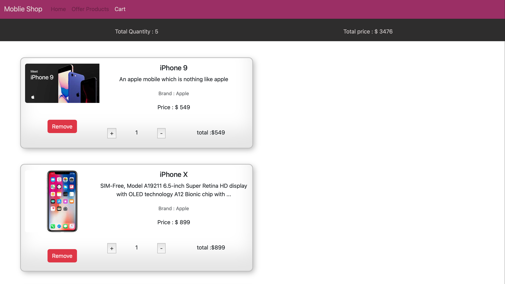

<h4>React useContext Task</h4>
<h6>Front-End:HTML,CSS,Bootstrap,React.JS</h6>

This Task get JSON data and create a cart page with per item price , per item quantity,
Total quantity and total amount

<h6>Functionalities Required</h6>

It needs to increase or decrease the per unit quantity, which should automatically update the total Quantity and Amount.

# React + Vite

This template provides a minimal setup to get React working in Vite with HMR and some ESLint rules.

Currently, two official plugins are available:

- [@vitejs/plugin-react](https://github.com/vitejs/vite-plugin-react/blob/main/packages/plugin-react/README.md) uses [Babel](https://babeljs.io/) for Fast Refresh
- [@vitejs/plugin-react-swc](https://github.com/vitejs/vite-plugin-react-swc) uses [SWC](https://swc.rs/) for Fast Refresh
